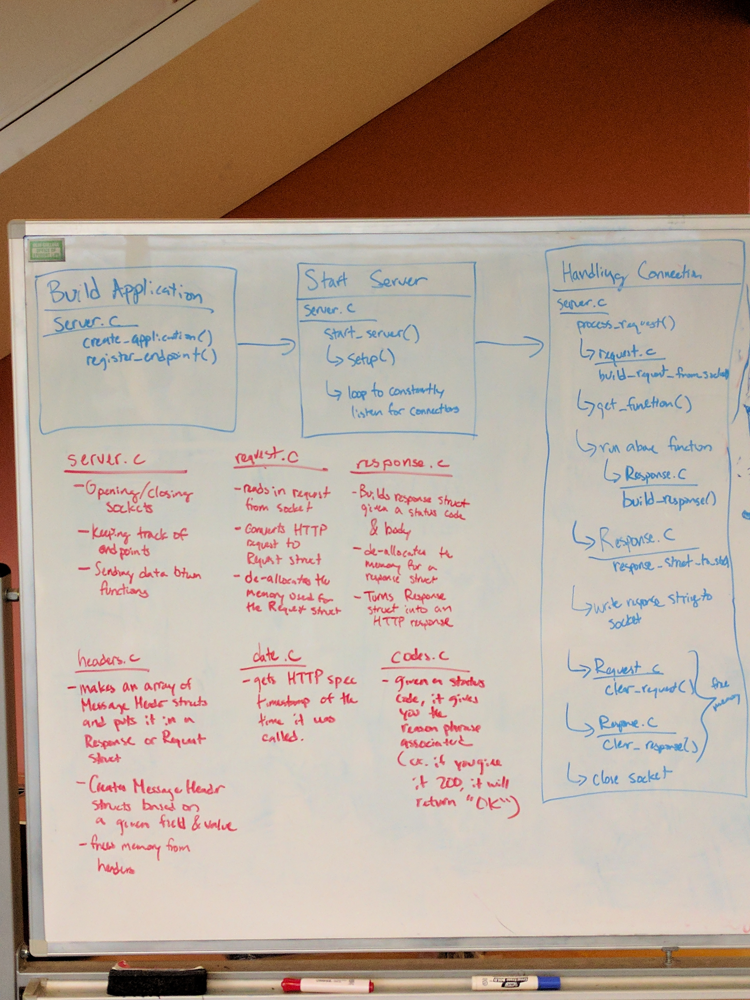

# Abstract

We made library for a webserver in C that handles requests, responses for any
basic web app. We split this project into two main portions: structs to parse
the HTTP traffic, and a wrapper for talking to the socket. The idea is that a
user who wants to write a web application with our library only has to write a
single function. The function should take in the broken down HTTP request as a
struct and determine the response code and body of the response. Our library
handles processes such as converting between HTTP requests/responses and structs,
and writing to sockets, and handling connections.

This was written by:
[Anne Ku](https://github.com/kuannie1),
[Samuel Myers](https://github.com/sammyers),
[Serena Chen](https://github.com/poosomooso),
[William Wong](https://github.com/billmwong)

# Background

<!-- This is our first project for a computing class at Olin College of Engineering:
ENGR 3525: Software Systems. We wanted to work with servers, so we chose to
create a library that simplifies the process of handling HTTP requests. By
simplifying the creation of web applications, we get to understand how servers
communicate in a network and help others deploy their ideas efficiently on the web.

We relied heavily on the HTTP specifications as well as using the examples for
socket communication from Head First C. We also looked at a HTTP server library
called [Tiny HTTPd](https://sourceforge.net/projects/tinyhttpd/)
to help us with starting our own server. -->

For programs on different machines to talk to each other, we need some machines
to behave as servers and some machines to behave as clients. To make sure this
connection is warranted, these machines need to follow a set of rules, or protocols
before they start to communicate. For this project, we use the Hypertext Transfer
Protocol (HTTP) to handle the server-client traffic and an abstracted
version of the Transfer Control Protocol for the sockets to prepare a request to
the server.

## Sockets

Since I/O file reading is not suitable for talking in the web, we need sockets, a
type of data stream. To connect to these sockets, however, we need to bind to the
server's port. This port will be a number that we can use to access the active
server. After making sure the port number works, then we make a system call called
listen() to see if the connection is warranted. After accepting the listen() system
call, the server waits until the client contacts the server again. This last step is
done under the accept() system call, which returns a second socket descriptor to
hold a proper server connection.

## Clients and Servers

For this project, there are two machines: the client and the server. They follow
the HTTP protocol, which specifies 2 main processes: a request and a response.
The request is made by a string of terms that is read from the socket. That
incoming string then gets parsed by our library to send to the user defined
application. After the application determines the correct response, our library
will take that response, convert it to HTTP, and send it back to the client.

# Implementation
The library has two main aspects: Communicating with the socket and sending data
through the HTTP protocol. We spent a long time figuring out how to architect
our system and modularize the code so all 4 of us could work on it.

In order to make this a library that a user could interface with, we had to be
able to insert the desired server logic in the standardized library methods. We
were initially imagining something where the user could call a function to start
the server, and then the server would somehow interrupt or prompt the user's
application when there was new data to process. However, after using pthreads,
we found out that it was possible to pass functions as parameters. Using that,
we were able to only require that the user's application pass in a function with
the right inputs and outputs when starting the server.

To handle the incoming data, we decided to use the regex library to parse the
incoming HTTP request strings one character. This incremental parsing helps us
account for special characters such as '\r\n' and ':'. The headers, messages,
and other portions in each request/response gets stored in arrays for easy
accessing. Because we couldn't dynamically make arrays of varying sizes, we
allocated <!-- some amount --> of memory to store fields for each request.

<!-- Our diagram here -->

# Results
<!-- Add images, screenshots, and videos here -->

<!-- ## Content we need to cover:

Big Idea/Abstract

The first thing someone should see when they land on your site is a quick and easily understandable explanation of what your project is all about.

Background

Provide context for your project by describing the broader space in which it is situated. This section will likely draw upon your annotated bibliography. You've already collected this knowledge and shown us you understand it, now frame it for an external audience.

Implementation

What specifically did you accomplish with this project? Within the context of the problem space, enumerate the potential options and explain why you chose what you did. Describe what makes it interesting/challenging, and how you overcame those challenges. Explain your implementation and design decisions with sufficient detail for a technical audience to understand it.

The library has two main aspects: Communicating with the socket and sending data
through the HTTP protocol. We spent a long time figuring out how to architect
our system and modularize the code so all 4 of us could work on it.

In order to make this a library that a user could interface with, we had to be
able to insert the desired server logic in the standardized library methods. We
were initially imagining something where the user could call a function to start
the server, and then the server would somehow interrupt or prompt the user's
application when there was new data to process. However, after using pthreads,
we found out that it was possible to pass functions as parameters. Using that,
we were able to only require that the user's application pass in a function with
the right inputs and outputs when starting the server.

Results

Provide evidence demonstrating that what you built works. Though the details will be different for each project, screenshots and video are likely helpful. Include graphs or other data if appropriate.

Having trouble with Pages? Check out our [documentation](https://help.github.com/categories/github-pages-basics/) or [contact support](https://github.com/contact) and we’ll help you sort it out.
 -->
